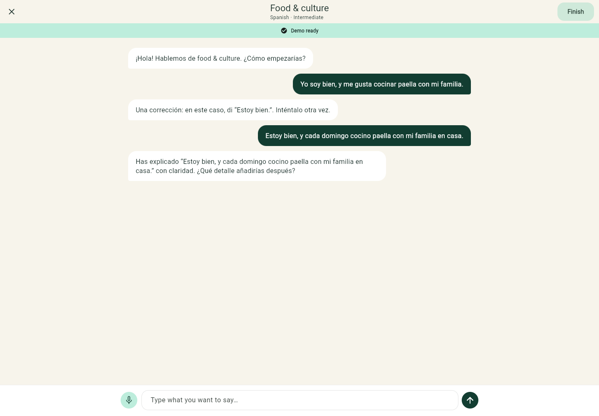
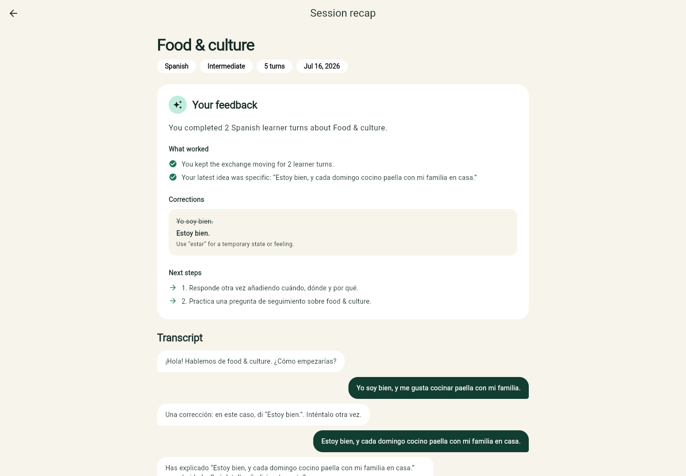
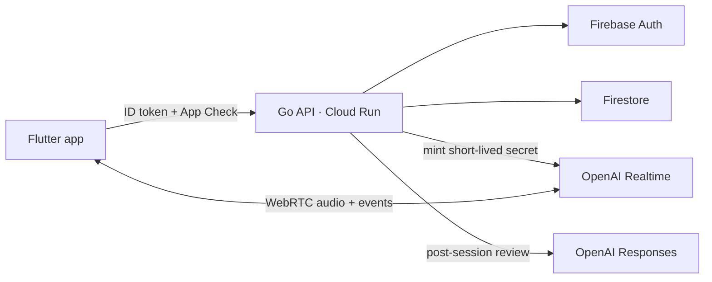

<p align="center">
  
</p>

<h1 align="center">Nia</h1>

<p align="center">
  Practice a language out loud, then get a clear review of what went well and what to try next.
</p>

<p align="center">
  <a href="https://github.com/bielcarpi/nia/actions/workflows/ci.yml"></a>
  <a href="https://github.com/bielcarpi/nia/actions/workflows/codeql.yml"></a>
  
  
  
</p>

Nia is a Flutter app backed by a Go API. A learner chooses a language, level,
topic, and correction style; the tutor holds a spoken practice session; Nia
saves the final text turns and generates strengths, corrections, and next
steps. History is private to the learner and can be deleted from the app.

<p align="center">
  
  
</p>

<p align="center"><sub>A real local demo run: active practice on the left, post-session feedback on the right.</sub></p>

## Run the demo

The default demo needs Flutter and Go, but no Firebase project, OpenAI key, or
cloud account.

```bash
git clone https://github.com/bielcarpi/nia.git
cd nia
make bootstrap
```

Start the API:

```bash
make dev-api
```

Then start the Flutter web app in a second terminal:

```bash
make dev-mobile
```

The app opens at `http://localhost:3000`. Its practice exchange is scripted,
while preferences, transcript turns, feedback, history, and deletion go through
the local Go API. [`docs/demo.md`](docs/demo.md) includes a short product tour
and a complete `curl` walkthrough.

## How it works



The Go API is a control plane rather than an audio relay. In production it
verifies Firebase identity and App Check, supplies the initial tutor settings,
creates a short-lived Realtime client secret, persists final text turns, and
requests the post-session review. Audio travels directly between the app and
OpenAI over WebRTC and is not stored by Nia. Those initial Realtime settings are
not an immutable policy boundary: a modified client holding a valid short-lived
secret can update the provider session. The trade-off is covered in
[`ADR-0002`](docs/adr/0002-direct-webrtc.md).

Three implementation choices carry most of the design:

- **One product, one repository.** Client, API, contract, tests, and deployment
  configuration change together.
- **Explicit runtime modes.** Demo adapters are deterministic and credential
  free; production adapters require Firebase, Firestore, and OpenAI settings.
- **A small Go boundary.** Authentication, storage, session issuance, and
  feedback are narrow interfaces, while HTTP ownership and error behavior stay
  in one service.

The request flows and trade-offs are in
[`docs/architecture.md`](docs/architecture.md).

## API and repository

The API covers preferences, realtime session creation, idempotent transcript
writes, feedback completion, cursor-paginated history, detail, and deletion.
[`contracts/openapi.yaml`](contracts/openapi.yaml) contains the OpenAPI 3.1
contract and concrete request/response examples.

```text
apps/
  api/                  Go API and Firebase/OpenAI adapters
  mobile/               Flutter app for iOS, Android, and Web
contracts/
  openapi.yaml          Public HTTP contract
docs/
  adr/                   Decisions and alternatives considered
  architecture.md       Boundaries and request flows
  demo.md               Five-minute product and API walkthrough
  development.md        Local and emulator development
  deployment.md         Google Cloud deployment and rollback
  operations.md         First-deploy signals and diagnostics
  security.md           Threat model and production checklist
infra/
  firebase/             Firestore client rules and emulator config
  terraform/            Bootstrap and Cloud Run service stacks
```

Common checks:

```bash
make format
make check
make openapi-lint
make terraform-check
```

CI runs Go formatting, vet, Staticcheck, race-enabled tests, `govulncheck`,
Flutter analysis/tests/web build, OpenAPI linting, Terraform validation, CodeQL,
and repository and container scans. Third-party Actions are pinned to commit
SHAs and tracked by Dependabot.

## Deploy

Terraform is split by lifecycle:

1. `infra/terraform/bootstrap` enables APIs and creates Artifact Registry, the
   runtime service account, Firestore IAM, and an empty Secret Manager secret.
2. `infra/terraform/service` deploys a digest-pinned Cloud Run revision with
   probes, scaling limits, explicit secret versioning, and two starter alerts.

Secret values never pass through Terraform. The manual release path, Firebase
setup, smoke test, rollback, and key rotation are documented in
[`docs/deployment.md`](docs/deployment.md).

The repository runs end to end in local demo mode. Production adapters and
infrastructure are implemented, but this README does not link to a hosted Nia
deployment. A real launch still needs project-specific Firebase configuration,
notification channels, budgets, privacy and retention decisions, and a verified
mobile release.

## Credits

Nia keeps the original repository history and credits
[Biel Carpi](https://github.com/bielcarpi),
[Alex Cano Gallego](https://github.com/AlexCanoGallego),
[Marc Geremias](https://github.com/marcgeremias), and everyone in the
[contributors graph](https://github.com/bielcarpi/nia/graphs/contributors).

## License

No open-source license is currently included. Rights across the historical
contributors must be confirmed before selecting one; source visibility alone
does not grant permission to copy, modify, or redistribute the code.
