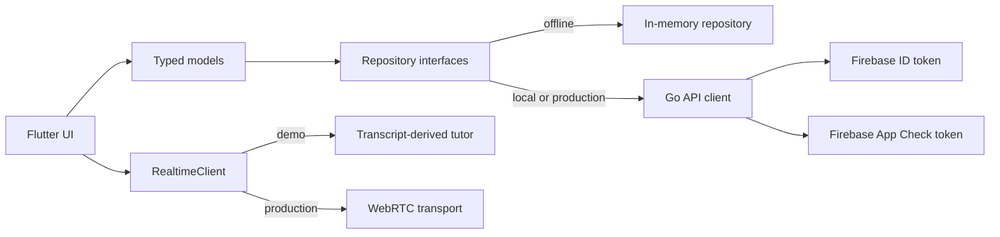

# Nia Flutter client

Nia is a responsive Flutter app for low-pressure language practice. The client
supports a credential-free offline demo, the repository's local Go API, and a
Firebase-authenticated production mode with realtime audio over WebRTC.

## Run the offline demo

```bash
flutter pub get
flutter run -d chrome
```

Choose **Open the demo**. Replies and feedback are generated locally from the
learner's saved transcript, selected language, topic, and correction style. The
flow includes preferences, text or simulated voice turns, history, pagination,
deletion, and completion feedback. Data stays in memory and resets on restart.

## Runtime modes

| Mode | Data | Realtime | Credentials |
| --- | --- | --- | --- |
| Offline demo (default) | In memory | Local deterministic tutor | None |
| Local stack | Local Go API | Transport selected by the local API | Fixed local demo token |
| Production | Go API | WebRTC grant issued by the API | Firebase Auth + App Check |

### Local Go API

Start the repository's API in its local demo-auth environment, then run:

```bash
flutter run -d chrome \
  --dart-define=NIA_DEMO_MODE=true \
  --dart-define=NIA_LOCAL_STACK=true \
  --dart-define=NIA_API_BASE_URL=http://localhost:8080
```

If `NIA_API_BASE_URL` is omitted in a demo build, it defaults to
`http://localhost:8080`. The fixed `nia-local-demo` bearer token is only for the
API's explicit local environment. App Check is not sent in this mode.

### Production

Production has no demo transport fallback. It requires an explicit, absolute,
non-local HTTPS API URL and complete Firebase configuration:

```bash
flutter run -d chrome \
  --dart-define=NIA_DEMO_MODE=false \
  --dart-define=NIA_API_BASE_URL=https://api.example.com \
  --dart-define=NIA_FIREBASE_API_KEY=... \
  --dart-define=NIA_FIREBASE_APP_ID=... \
  --dart-define=NIA_FIREBASE_MESSAGING_SENDER_ID=... \
  --dart-define=NIA_FIREBASE_PROJECT_ID=... \
  --dart-define=NIA_FIREBASE_AUTH_DOMAIN=... \
  --dart-define=NIA_FIREBASE_RECAPTCHA_SITE_KEY=...
```

`NIA_FIREBASE_RECAPTCHA_SITE_KEY` is required for production web builds.
Android uses Play Integrity; Apple platforms use App Attest with a Device Check
fallback. Register each released app with Firebase App Check before enforcing
attestation on the API. The iOS target includes the production App Attest
entitlement; its App ID and release provisioning profile must also enable the
App Attest capability in the Apple Developer portal.

Invalid production configuration renders a startup error instead of silently
switching to demo data. The API URL parser rejects HTTP, localhost, credentials,
paths, queries, and fragments. Realtime responses are also parsed strictly:
production accepts only a WebRTC transport with an HTTPS endpoint, short-lived
client secret, model, positive expiry, and a complete conversation object.

Project-specific Firebase service files are not committed. Runtime Firebase
options come from `--dart-define`; native release pipelines can provide ignored
platform files when their tooling requires them. Native signing material is
also intentionally absent: an Android release pipeline must inject its private
keystore and signing configuration, while an Apple release pipeline must select
the owning team and an App-Attest-enabled provisioning profile.

## Architecture



- `AuthService` isolates Firebase authentication and account flows from the UI.
- `ApiClient` owns timeouts, typed error envelopes, correlation IDs, and auth
  headers.
- Repository interfaces keep in-memory and HTTP-backed data flows consistent.
- `WebRtcTransport` isolates the platform plugin, peer connection, media track,
  and data channel from protocol handling.
- The app receives a server-minted ephemeral realtime secret; a provider API
  key is never shipped in the client.

## Realtime lifecycle

1. The client requests a session from `POST /api/v1/realtime/sessions`.
2. The Go API returns the conversation and its realtime transport metadata.
3. Production posts a WebRTC SDP offer to the returned HTTPS endpoint using the
   ephemeral bearer secret, then applies the SDP answer.
4. Text messages use the realtime data channel. Microphone permission failure
   leaves the data channel and typed composer available.
5. Transcript turns are persisted with client-generated IDs so retries are
   idempotent.
6. Leaving the screen stops media tracks and closes the data channel, peer
   connection, renderer, subscriptions, and HTTP client.
7. Completing a conversation waits for pending transcript writes before asking
   the API for structured feedback.

The automated suite exercises this lifecycle through a fake transport and HTTP
server. A live provider session and physical-device media permissions remain
release checks, not claims made by the unit tests.

## API contract

- `GET/PATCH /api/v1/me/preferences`
- `POST /api/v1/realtime/sessions`
- `GET /api/v1/conversations`
- `GET/DELETE /api/v1/conversations/{id}`
- `PUT /api/v1/conversations/{id}/turns/{turn_id}`
- `POST /api/v1/conversations/{id}/complete`

Errors use `{ "error": { "code", "message", "request_id" } }`; list responses
use `{ "items", "next_cursor"? }`. Required response fields and enum values are
validated instead of being replaced with client defaults. Unknown additional
fields remain forward-compatible.

## Source layout

```text
lib/
├── app/          startup, dependency ownership, and app shell
├── config/       runtime configuration and validation
├── core/         HTTP, authentication, App Check, and theme
├── data/         HTTP and in-memory repositories
├── domain/       models and the local demo tutor
├── realtime/     protocol client and WebRTC transport
└── ui/           responsive screens and shared widgets
```

Dependencies are constructed once and passed through narrow interfaces. There
is no global service locator.

## Verification

```bash
dart format --output=none --set-exit-if-changed lib test
flutter analyze --fatal-infos
flutter test
flutter build web --release --dart-define=NIA_DEMO_MODE=true
```

Tests cover strict configuration and grant parsing, API auth and error handling,
the demo lifecycle and transcript-derived feedback, WebRTC protocol events,
microphone-denied typed chat, account validation and password reset, history
pagination and disposal races, completion write barriers, and the narrow-screen
practice journey.

## Security notes

- No provider API key or project-specific Firebase service file is committed.
- Passwords, tokens, transcripts, and realtime protocol payloads are not logged.
- Production API calls include Firebase ID and App Check tokens.
- Production accepts only a server-issued WebRTC grant with an expiry.
- Microphone use is explicit and scoped to an active conversation screen.
- Conversation deletion is available from history.
- The offline demo does not make network requests.

The mobile client is not a security boundary. The Go API must verify Firebase
Auth and App Check, enforce resource ownership and quotas, constrain realtime
sessions, and redact sensitive logs.
