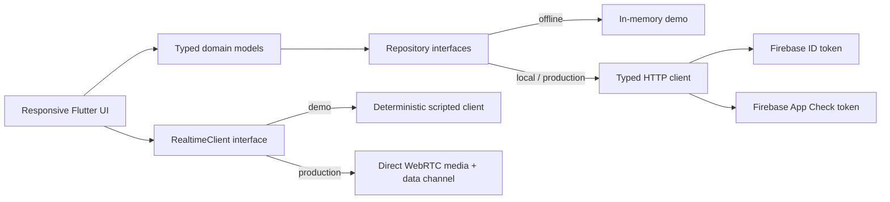

# Nia Flutter client

The Nia client is a responsive Flutter app for low-pressure language practice. It includes a complete offline demo, an end-to-end local API mode, and production boundaries for Firebase authentication, Firebase App Check, and OpenAI Realtime over WebRTC.

The default build needs no account, API key, Firebase project, microphone, or backend.

## Try it

```bash
flutter pub get
flutter run -d chrome
```

Choose **Open the demo**. The demo covers session preferences, a deterministic conversation, idempotent transcript persistence, conversation history, deletion, and structured feedback. Its data is held in memory and resets on restart.

## Runtime modes

| Mode | Purpose | Data path | Realtime path |
| --- | --- | --- | --- |
| Offline demo (default) | Reviewer-friendly product tour | In-memory repository | Deterministic local client |
| Local stack | Exercise Flutter → Go API without credentials | Go API local store | API-selected demo transport |
| Production | Real authenticated application | Firebase-authenticated Go API | Short-lived WebRTC grant |

### Local stack

Start the repository's Go API in local demo-auth mode, then run:

```bash
flutter run -d chrome \
  --dart-define=NIA_DEMO_MODE=true \
  --dart-define=NIA_LOCAL_STACK=true \
  --dart-define=NIA_API_BASE_URL=http://localhost:8080
```

The `DemoAuthService` owns the fixed `nia-local-demo` bearer token. The API accepts it only in its explicit local environment; the production server rejects it. App Check is intentionally omitted in this mode.

### Production

Production fails closed when required Firebase configuration is absent:

```bash
flutter run -d chrome \
  --dart-define=NIA_DEMO_MODE=false \
  --dart-define=NIA_API_BASE_URL=https://api.example.com \
  --dart-define=NIA_FIREBASE_API_KEY=... \
  --dart-define=NIA_FIREBASE_APP_ID=... \
  --dart-define=NIA_FIREBASE_MESSAGING_SENDER_ID=... \
  --dart-define=NIA_FIREBASE_PROJECT_ID=... \
  --dart-define=NIA_FIREBASE_AUTH_DOMAIN=... \
  --dart-define=NIA_FIREBASE_RECAPTCHA_SITE_KEY=...
```

`NIA_FIREBASE_RECAPTCHA_SITE_KEY` is required for production web builds. Android uses Play Integrity and Apple platforms use App Attest with a Device Check fallback. Register each shipped app with Firebase App Check before enabling server-side enforcement.

Project-specific `google-services.json`, `GoogleService-Info.plist`, and generated Firebase options are deliberately not committed. Runtime Firebase options come from `--dart-define`; native store builds may still use local, ignored platform files when required by their release pipeline.

## Architecture



The important boundaries are deliberately small:

- `AuthService` isolates Firebase from the UI and never logs credentials.
- `AppCheckTokenProvider` adds `X-Firebase-AppCheck` only in production.
- `ApiClient` enforces timeouts, typed error envelopes, correlation IDs, and bearer/App Check headers.
- `PreferencesRepository` and `ConversationRepository` make local and remote behavior interchangeable.
- `RealtimeClient` separates deterministic review flows from the real WebRTC transport.
- `WebRtcRealtimeClient` receives only a short-lived client secret issued by the Go API. A long-lived OpenAI key never enters the app.

## Realtime lifecycle

1. The client calls `POST /api/v1/realtime/sessions` with language, level, topic, and correction style.
2. The Go API returns a conversation plus either a demo transport or a short-lived WebRTC client secret.
3. For WebRTC, the client opens one peer connection to the returned SDP endpoint. The microphone track begins muted.
4. The learner explicitly unmutes. Audio stays in the WebRTC media track; the app does not write whole-session audio files or retain audio buffers.
5. Transcript turns are idempotently persisted with client-generated turn IDs.
6. Leaving or finishing stops every media track and closes the data channel and peer connection.
7. Completing the conversation returns structured strengths, corrections, and next steps.

The implementation recognizes current text and audio-transcript delta/done events. The server owns the realtime session policy, model, voice, input transcription, and tutor instructions.

## API contract used by the client

- `GET/PATCH /api/v1/me/preferences`
- `POST /api/v1/realtime/sessions`
- `GET /api/v1/conversations`
- `GET/DELETE /api/v1/conversations/{id}`
- `PUT /api/v1/conversations/{id}/turns/{turn_id}`
- `POST /api/v1/conversations/{id}/complete`

Errors use `{ "error": { "code", "message", "request_id" } }`. List endpoints use `{ "items", "next_cursor"? }`. JSON parsing tolerates harmless additional fields while keeping feedback corrections and next steps lossless.

## Source map

```text
lib/
├── app/          composition root and dependency ownership
├── config/       fail-closed runtime configuration
├── core/         HTTP, auth, App Check, and visual foundations
├── data/         API and in-memory repository implementations
├── domain/       wire-compatible models
├── realtime/     deterministic and WebRTC transports
└── ui/           responsive product screens and shared components
```

There is no global service locator and no state-management framework. Dependencies are constructed once, passed explicitly, and represented by narrow interfaces. This keeps tests fast and makes security-sensitive behavior visible during review.

## Quality checks

```bash
dart format --output=none --set-exit-if-changed lib test
flutter analyze
flutter test
flutter build web --release --dart-define=NIA_DEMO_MODE=true
```

Tests cover:

- the public preferences and feedback JSON contracts;
- the complete in-memory conversation lifecycle and idempotent turns;
- authorization, App Check, and request-correlation headers;
- typed API error handling; and
- the full narrow-screen demo journey from landing page to feedback.

## Security and privacy notes

- No provider API key or project-specific Firebase file is committed.
- Passwords, tokens, transcripts, and realtime protocol payloads are never logged.
- Production API calls carry both a Firebase ID token and App Check token.
- The WebRTC credential is short-lived and scoped by the server-created session.
- Microphone access is explicit and bounded to a live screen.
- Conversation deletion is a first-class user action.
- The offline demo does not make network requests.

This directory is a client, not a security boundary. The Go API must still verify Firebase Auth and App Check, enforce ownership and quotas, constrain realtime sessions, and redact application logs.
