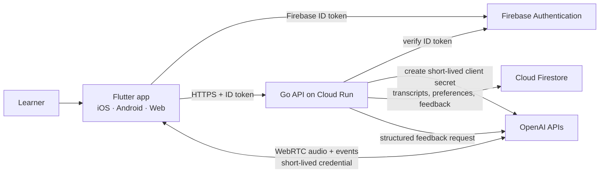
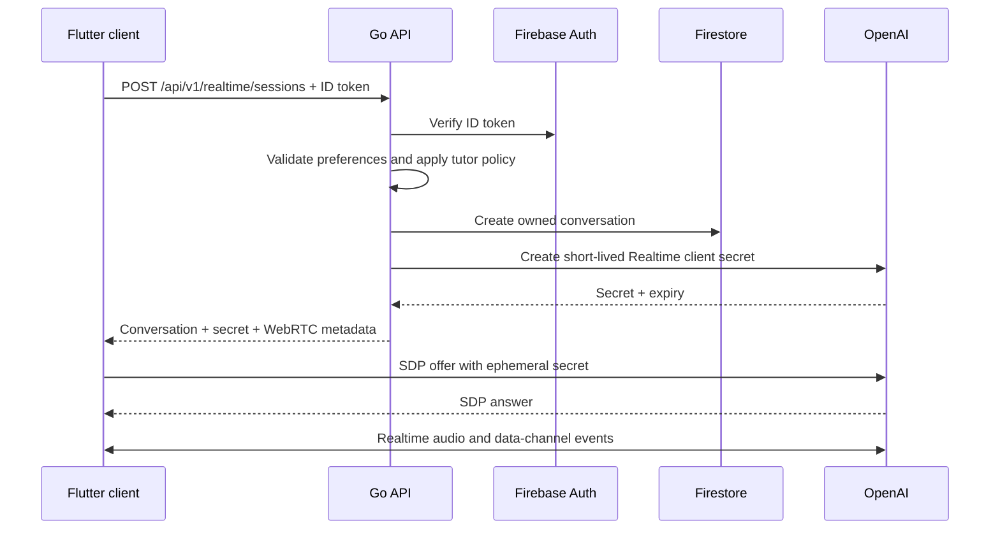
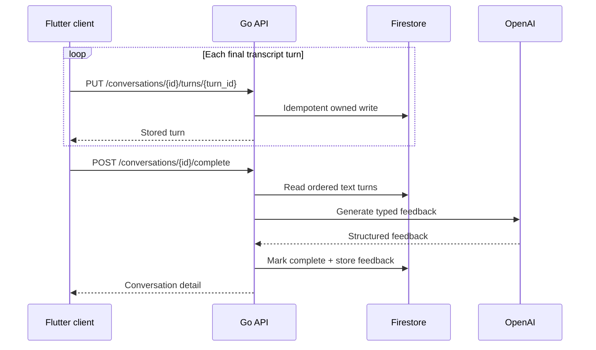

# Architecture

Nia is deliberately a two-application monorepo: a Flutter client and one Go
control-plane API. The client owns realtime media. The API owns identity,
policy, provider credentials, persistence, limits, and feedback.

This split keeps the latency-sensitive audio path short without exposing a
long-lived OpenAI key or putting security decisions in the client.

## System context

The direct WebRTC connection is an intentional data-path choice. Nia's API
does not relay audio and does not persist raw audio. Text turns are written
through the API so authorization, validation, retention, and deletion stay in
one place.

## Components and boundaries

| Component | Owns | Does not own |
| --- | --- | --- |
| Flutter app | Sign-in UX, preferences UX, WebRTC lifecycle, transcript display, local interaction state | Provider API keys, authorization policy, durable records |
| Go API | Token verification, tutor policy, ephemeral session issuance, quotas, transcript writes, feedback orchestration, deletion | Audio transport, mobile UI, long-running workflow infrastructure |
| Firebase Authentication | End-user identity and ID-token issuance | Nia authorization decisions |
| Firestore | Durable preferences, conversation text, feedback | Raw audio or provider credentials |
| OpenAI Realtime API | Low-latency model audio and realtime events | Nia user records or retention policy |
| OpenAI Responses API | Post-session structured feedback | Conversation ownership |

The API code depends on narrow provider interfaces for authentication,
persistence, session issuance, and feedback generation. Production adapters
can fail independently; in-memory/demo adapters make behavior deterministic
without weakening production configuration.

## Core request flows

### Start a realtime session

Production logs include correlation metadata and provider request identifiers,
but never the client secret, authorization header, transcript text, or audio.

### Persist and complete a conversation

Client-generated turn IDs make retries safe. The completion operation returns
the existing result after a successful completion, so a network retry does not
generate duplicate feedback. Completion is accepted only after at least one
learner/user turn is durable; an assistant greeting alone cannot spend the
feedback-generation quota.

## Data model

The public contract uses four domain records:

- `Preferences`: target language, level, practice topic, and correction style.
- `ConversationSummary`: owner-scoped lifecycle metadata and a preference
  snapshot. Capturing the snapshot makes old feedback interpretable after a
  learner changes their defaults.
- `Turn`: a client-idempotent, timestamped user or assistant text turn.
- `Feedback`: summary, strengths, corrections, next steps, and generation time.

The API returns `404` for both missing and non-owned conversations. This avoids
turning resource IDs into an ownership oracle. The concrete Firestore layout is
an adapter detail; clients use only the HTTP contract in
[`contracts/openapi.yaml`](../contracts/openapi.yaml).

Firestore user document IDs are a deterministic SHA-256/base64url mapping of
the verified Firebase UID. This keeps raw identity strings out of database paths
and guarantees path-safe keys; it is a storage-key hardening measure, not
anonymization, because the records still belong to an identifiable account.

## Runtime modes

| Mode | Authentication | Storage | AI provider | Purpose |
| --- | --- | --- | --- | --- |
| `demo` | Fixed local identity | In memory | Deterministic scripted adapter | Clone-and-run review, tests, UI work |
| `production` | Firebase ID-token verification | Firestore | OpenAI Realtime + Responses | Deployed service |

Production configuration fails closed when required identity, storage, or
provider settings are missing. Demo mode must be selected explicitly by the API
process and is never inferred from a missing credential.

## Reliability and scaling

- Cloud Run instances are stateless. Session and transcript state lives in
  Firestore, so horizontal scaling does not require sticky sessions.
- `/healthz` is a process-only liveness probe. `/readyz` checks whether required
  dependencies are usable and backs the Cloud Run startup and operator checks.
- The server handles `SIGTERM`, stops accepting new work, and drains in-flight
  HTTP requests within Cloud Run's termination window.
- Request deadlines bound provider calls. A failed feedback call leaves the
  stored transcript recoverable and completion retryable.
- Per-identity session/feedback windows plus per-instance request and provider
  concurrency reduce accidental abuse. The in-memory windows are intentionally
  approximate across autoscaled instances; hard spend enforcement needs a
  shared quota ledger or provider/platform budget controls when traffic merits
  that complexity.
- Request IDs cross the client/API boundary; provider request IDs are recorded
  separately for support correlation.

See [operations.md](operations.md) for proposed service objectives, alerts, and
runbooks. Those objectives are targets for a deployment, not claims about a
currently hosted service.

## Deliberate omissions

Nia is not split into microservices and does not use Kubernetes, Redis,
GraphQL, or a workflow engine. The workload is a small control plane around a
provider-managed realtime data path. Those systems would add operational
surface before they add meaningful reliability.

Future extraction should be driven by evidence: an independently scaling
workload, a distinct security boundary, or a release cadence the modular Go
code can no longer support cleanly.

## Decisions

- [ADR 0001: One product monorepo](adr/0001-monorepo.md)
- [ADR 0002: Direct WebRTC with server-issued client secrets](adr/0002-direct-webrtc.md)
- [ADR 0003: One stateless Cloud Run API with Firestore](adr/0003-cloud-run-firestore.md)
